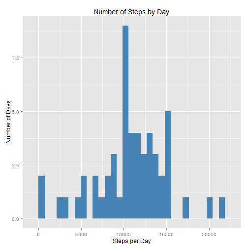
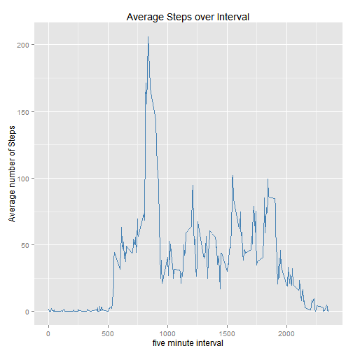
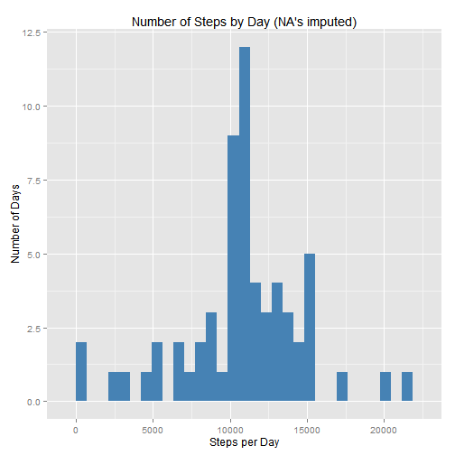
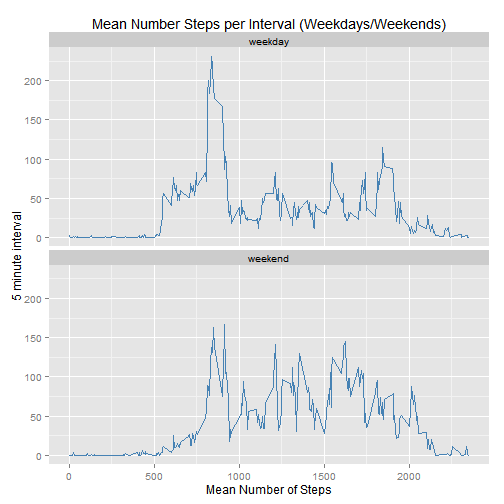

### Loading and preprocessing the data

First load the data into R and convert date varible to date class
load dplyr, ggplot2 and stats packages

```r
input <- read.csv("activity.csv", header = T, sep = ",")
input$date <- as.Date(input$date, "%Y-%m-%d")
require(dplyr,quietly = FALSE, warn.conflicts = FALSE)
require(ggplot2,quietly = FALSE, warn.conflicts = FALSE)
require(stats,quietly = FALSE, warn.conflicts = FALSE)
```

Calculate the number of steps per day, ignoring the missing values.
I'm using the dplyr package


```r
stepPerDay <- input %>%
        group_by(date) %>%
        summarize(total_steps = sum(steps))%>%
        arrange(date)
```

### What is mean total number of steps taken per day?

Plot a histogram of total number of steps per day.


```r
histStepDay <- ggplot(stepPerDay, aes(total_steps))
histStepDay <- histStepDay + geom_histogram(fill = "steelblue")
histStepDay <- histStepDay + ggtitle( "Number of Steps by Day" )
histStepDay <- histStepDay + xlab("Steps per Day")
histStepDay <- histStepDay + ylab("Number of Days")
histStepDay
```

 

The mean of the total number of steps taken per day

```r
mean(stepPerDay$total_steps, na.rm = T)
```

```
## [1] 10766.19
```
The median of the total number of steps taken per day

```r
median(stepPerDay$total_steps, na.rm = T)
```

```
## [1] 10765
```

### What is the average daily activity pattern?

The average number of steps taken over a 5 minute interval, averaged across all days.

```r
fiveMinAve <- input %>%
        group_by(interval) %>%
        summarize(avg_step = mean(steps, na.rm = T)) %>%
        arrange(interval)
```

Create a Time Series plot of the Average number of Steps takes over a 5 minute interval.

```r
ts <- ggplot(fiveMinAve, aes(x = interval, y = avg_step))
ts <- ts + geom_line(colour = "steelblue", size = 0.5)
ts <- ts + ggtitle("Average Steps over Interval")
ts + xlab("five minute interval") + ylab("Average number of Steps")
```

 

Which 5-minute interval, on average across all the days in the dataset contains the maximum number of steps?

```r
as.data.frame(fiveMinAve[fiveMinAve$avg_step %in% max(fiveMinAve$avg_step),])
```

```
##   interval avg_step
## 1      835 206.1698
```

### Imputing missing values

Number of missing values in the data set (only steps varialbe considered)

```r
sum(is.na(input$steps))
```

```
## [1] 2304
```
Filling in all of the missing values in the dataset. I chose to use the mean value for the
5 minute interval.


First join the input data with the 5-minute interval average

```r
joinedData <- inner_join(input, fiveMinAve)
```

```
## Joining by: "interval"
```
If the step value is NA replace it with the average value for the 5 minute interval

```r
for(i in 1:dim(joinedData)[1]){
        if(is.na(joinedData[i,]$steps)){
                joinedData[i,]$steps <- joinedData[i,]$avg_step                
        }
}
```
Create a new dataset that is equal to the original dataset but with the missing data filled in
with the average values for the 5 minute intervals.

```r
joinedData <-joinedData[,1:3]
```
Get the total number of steps per day

```r
stepPerDay2 <- joinedData %>%
        group_by(date) %>%
        summarize(total_step = sum(steps)) %>%
        arrange(date)
```
Plot a histogram of total number of steps per day with missing values being replaced with averages.

```r
histDay2 <- ggplot(stepPerDay2, aes(total_step))
histDay2 <- histDay2 + geom_histogram(fill = "steelblue")
histDay2 <- histDay2 + ggtitle( "Number of Steps by Day (NA's imputed)" )
histDay2 <- histDay2 + xlab("Steps per Day")
histDay2 <- histDay2 + ylab("Number of Days")
histDay2
```

 

The new mean of the total number of steps taken per day.

```r
mean(stepPerDay2$total_step)
```

```
## [1] 10766.19
```
The new median of the total number of steps taken per day.

```r
median(stepPerDay2$total_step)
```

```
## [1] 10766.19
```
There isn't a significat different between the mean/meadian claculated with NA's
and after the NA's were replaced with the average value of steps in the five minute interval.

### Are there differences in activity patterns between weekdays and weekends?

Create a new factor variable in the dataset with two levels - "weekday" and "weekend"

```r
joinedData$weekday <- weekdays(joinedData$date, abbreviate = FALSE)
```
Create a factor variable which takes value 1 if the day is weekday and the value 2 if the day is weekend day.

```r
joinedData$day_index <- 0
for(i in 1:dim(joinedData)[1]){
        if (joinedData[i,]$weekday %in% c(
                "Monday","Tuesday","Wednesday","Thursday","Friday" )){
                joinedData[i,]$day_index <- 1
        }else{
                joinedData[i,]$day_index <- 2    
        }
}
```
Coerce day_index into factor variable

```r
joinedData$day_index <- as.factor(joinedData$day_index)
levels(joinedData$day_index) <- c("weekday", "weekend")
head(joinedData)
```

```
##       steps       date interval weekday day_index
## 1 1.7169811 2012-10-01        0  Monday   weekday
## 2 0.3396226 2012-10-01        5  Monday   weekday
## 3 0.1320755 2012-10-01       10  Monday   weekday
## 4 0.1509434 2012-10-01       15  Monday   weekday
## 5 0.0754717 2012-10-01       20  Monday   weekday
## 6 2.0943396 2012-10-01       25  Monday   weekday
```
Calculate the average step per interval grouped by week/weekend day.

```r
weekdayPlotData <- joinedData %>%
        select(steps, interval, day_index) %>%
        group_by(day_index, interval) %>%
        summarize(mean_step = mean(steps)) %>%
        arrange(day_index)

options(scipen = 999)
```
Create a panel Time Series plot which splits the mean number of steps over the five minute interval
according to weekdays and weekends.

```r
panelPlot <- ggplot(weekdayPlotData, aes(x = interval, y = mean_step))
panelPlot <- panelPlot + geom_line(colour = "steelblue", size = 0.2)
panelPlot <- panelPlot + facet_wrap(~ day_index, nrow = 2, ncol = 1)
panelPlot <- panelPlot + ggtitle("Mean Number Steps per Interval (Weekdays/Weekends)")
panelPlot + xlab("Mean Number of Steps") + ylab("5 minute interval")
```

 
